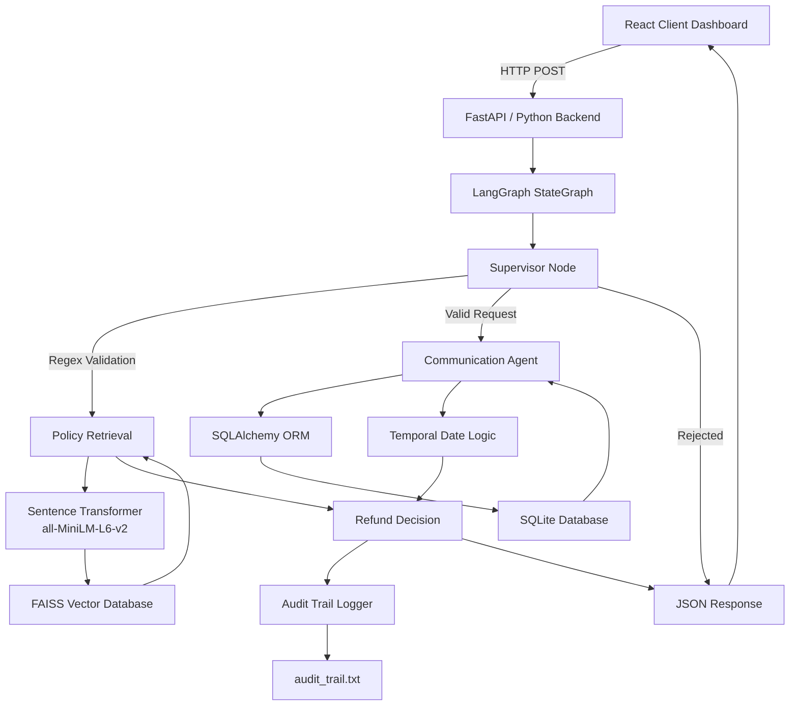

# 🛡️ Autonomous Multi-Agent Enterprise Refund Orchestrator

A production-grade, full-stack event-driven decision engine that automates complex corporate refund evaluation pipelines. The platform replaces traditional, fragile nested conditional logic with an asynchronous **LangGraph Multi-Agent State Machine**, paired with a localized **FAISS Vector Database** for semantic policy parsing and an ORM data access layer via **SQLAlchemy**.

---

## 🏗️ Architectural Topology & Component Flow

The platform is designed with strict separation of concerns, decoupling the reactive client dashboard from the intelligent, stateful orchestration backend.


### Architectural Breakdown
1. **Presentation Layer (React):** A responsive, single-page client dashboard utilizing state hook parameters to provide explicit structural visibility into system variables, raw database payloads, and pipeline delivery schemas.
2. **Orchestration Core (LangGraph):** A stateful workflow machine (`StateGraph`) using deterministic edge routing to pass transaction contexts dynamically across a network of isolated processing nodes.
3. **Semantic Knowledge Retrieval (RAG / FAISS):** Encodes incoming unstructured text strings into 384-dimensional dense vectors using the `all-MiniLM-L6-v2` transformer model. A local **FAISS (Facebook AI Similarity Search)** L2-distance index maps intent straight to corporate compliance clauses without cloud API bottlenecks.
4. **Relational Persistence Layer (SQLAlchemy):** Utilizes Python's SQLAlchemy Object-Relational Mapper to query an internal transactional SQLite cluster to validate sequence chronologies, categories, and payment flags.

---

## ⚡ Core Engineering Implementations

* **🛑 Asynchronous Ingestion & Category Gatekeepers:** The `Supervisor Node` runs regex validation tokens over incoming requests. It acts as an architectural firewall—intercepting metadata payloads and enforcing strict catalog constraints (e.g., immediate termination of non-refundable digital software software downloads) before triggering expensive vector search computes.
* **📐 High-Precision Temporal Mathematics:** The communication agent computes runtime date deltas between live operational dates and original transaction records, enforcing structured tiered return metrics (e.g., 100% standard refund vs. 50% partial store credit windows).
* **📜 Column-Aligned Telemetry Logging Engine:** To maintain enterprise observability, an automated file initialization and logging lifecycle writes running micro-step contexts directly into an aligned `audit_trail.txt` file format.

---

## 🚀 Deployment Manual

Follow these steps to deploy the decoupled stack natively in your local sandbox environment.

### System Requirements
* Node.js (v18 or higher)
* Python 3.9+

### 1. Initialize the Python ASGI Microservice
Navigate to the root directory and activate your backend runtime server:

```bash
# Provision local execution environment dependencies
***pip install -r requirements.txt

# Boot the production-ready ASGI web server
***python main.py


